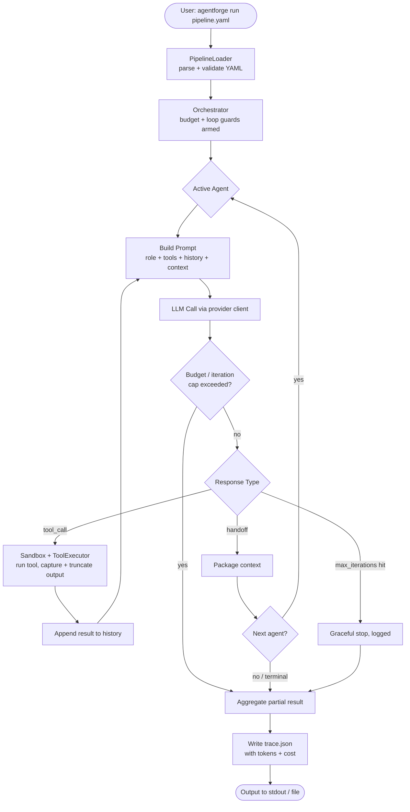
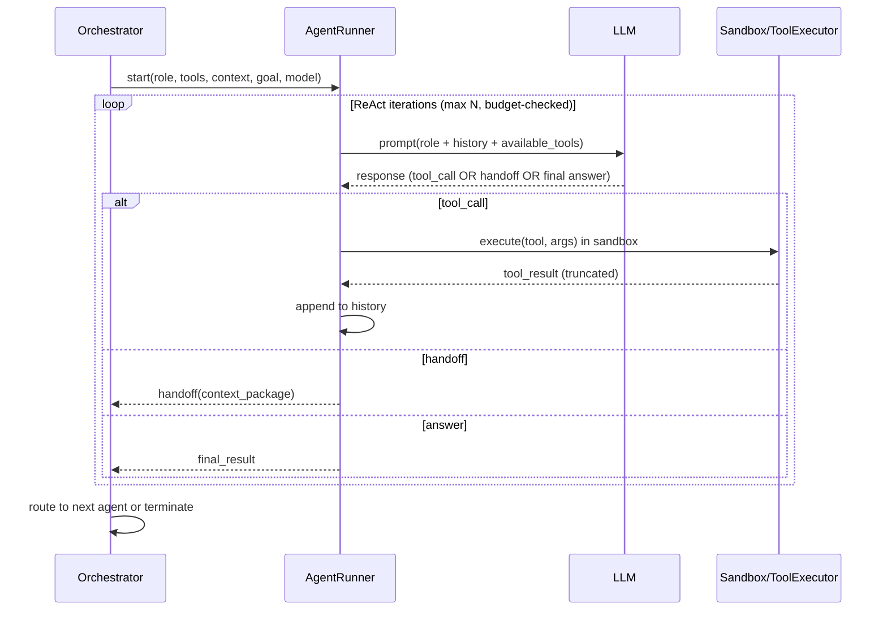
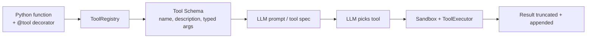

# AgentForge
### Build multi-agent AI pipelines with a YAML config file — bring your own model, your own provider, your own tools. No framework lock-in.

> **Project docs:** build status, V1-vs-V2 scope, and phase tracking live in [ROADMAP_AND_PROGRESS.md](ROADMAP_AND_PROGRESS.md). This PRD is the design contract.

---

## Why Build This

Multi-agent orchestration is the loudest topic in AI engineering. Every company hiring AI engineers asks "have you built agentic systems?" This project gives a real, deployable answer — and forces understanding of how agents work at the loop level, not just by calling `CrewAI.run()`.

**What you'll learn:**
- How ReAct (Reason + Act) loops work — the core algorithm behind every AI agent
- How to design tool interfaces an LLM can call reliably (native tool-calling *and* a text fallback)
- How to make agents safe: sandboxed code execution, hard cost caps, loop guards
- How context and cost flow between agents across a multi-step workflow

**Why it stands out on a resume:**
Most "AI engineers" have used LangChain. Very few have built their own orchestration layer *with* a sandbox abstraction, per-run budget enforcement, and a multi-provider model layer. Building AgentForge means you understand what LangGraph/AutoGen do underneath — and you've solved the production problems they paper over.

**Standalone value:**
Clone the repo, write a `pipeline.yaml`, add one API key, and have a working, traced, cost-capped multi-agent workflow in 20 minutes. Works with any OpenRouter model and several direct providers.

---

## Problem

Single-prompt LLM apps work fine for one thing. Real tasks — research a competitor, draft a proposal, review code — need multiple steps, different expertise, and external tools.

| Approach | Problem |
|---|---|
| Chain prompts manually | Brittle, hard to debug, impossible to reuse |
| Use LangGraph / CrewAI | Deep framework coupling, steep curve, hard to customize, no first-class cost control |

There's no lightweight, bring-your-own-model agent framework where the pipeline is just a config file — and where **cost and safety are first-class, not afterthoughts**.

---

## What It Does

Define a pipeline of agents in YAML. Each agent has a role (system prompt), tools it may use, an optional model override, and a handoff rule. The runtime runs the ReAct loop, executes tools in a sandbox, enforces a hard spend cap, handles handoffs, and writes a full `trace.json`.

**Example — 3-agent research pipeline:**

```yaml
# pipeline.yaml
name: competitor-research

llm:
  provider: openrouter                 # openrouter | anthropic | openai | ollama
  model: deepseek/deepseek-v4-flash    # strong, ~$0.09/$0.18 per M tokens, 1M context
  api_key_env: OPENROUTER_API_KEY

budget:
  max_usd_per_run: 0.25                # hard cap — aborts the run if exceeded
  max_total_iterations: 30             # across the whole pipeline

sandbox:
  backend: subprocess                  # subprocess | docker | e2b
  network: false                       # tools that need net (web_search) are exempt
  timeout_s: 20

permissions:
  mode: prompt                         # auto | prompt | strict
  auto_approve: [web_search, read_url, read_file, read_note]   # safe / read-only
  require_approval: [write_file, run_python]                   # side-effecting → ask first
  deny: []
  non_interactive: deny                # no TTY (CI): deny | allow_auto_approved

agents:
  researcher:
    role: Search the web and collect key facts about the target company. When you have 5+ facts, hand off to the writer.
    tools: [web_search, read_url, save_note]
    handoff_to: writer
    max_iterations: 10

  writer:
    role: Read the research notes and write a 300-word competitive analysis. Then hand off to the reviewer.
    model: z-ai/glm-4.7-flash          # per-agent override — cheaper model for a simpler job
    tools: [read_note, write_file]
    handoff_to: reviewer

  reviewer:
    role: Review the draft for accuracy and clarity. Return the final approved version.
    tools: [read_file, write_file]
    terminal: true

start: researcher
```

Run it:
```bash
agentforge run pipeline.yaml --goal "Research Notion's pricing and positioning vs Linear"
```

---

## Models & Providers

AgentForge is **provider-agnostic**. An abstract `LLMClient` base defines one interface; concrete clients implement it. v1 ships **four**:

| Provider | Use | Auth |
|---|---|---|
| `openrouter` | **Default.** One key, hundreds of models (DeepSeek, Qwen, GLM, Kimi, MiniMax, Claude, GPT, Gemini…) | `OPENROUTER_API_KEY` |
| `anthropic` | Direct Claude access | `ANTHROPIC_API_KEY` |
| `openai` | Direct GPT access | `OPENAI_API_KEY` |
| `ollama` | Local models, zero cost, fully offline | none (localhost) |

**Tool-calling strategy:** native function-calling is the primary path (the strong models below all support it). A **text-based ReAct parser** (`Thought / Action / Action Input` as tolerant JSON) is the automatic fallback for models without tool support — so the framework works everywhere, including local Ollama models.

**Model discovery:** `agentforge models` queries OpenRouter's live catalog (slugs + pricing change often) and prints tool-capable models with current prices, so defaults are never stale.

**Recommended defaults (verified live, mid-cost, tool-capable):**

| Model | In / Out ($/M) | Context | Good for |
|---|---|---|---|
| `deepseek/deepseek-v4-flash` | 0.09 / 0.18 | 1M | **Default reasoner** — cheap, huge context, strong |
| `z-ai/glm-4.7-flash` | 0.06 / 0.40 | 200K | Cheap worker agents |
| `qwen/qwen3-30b-a3b-instruct-2507` | 0.05 / 0.19 | 131K | Cheap worker agents |
| `minimax/minimax-m2.5` | 0.15 / 0.90 | 205K | Strong general agent |
| `anthropic/claude-*` (via direct or OpenRouter) | varies | 200K+ | Hardest reasoning/review steps |

At these prices a typical 3-agent run costs **~$0.01–0.03**, so a $20–30 budget is 1,000+ runs. **Per-agent model override** lets you spend strong-model money only where it matters.

---

## Architecture

### Pipeline Execution Flow



### ReAct Loop (Single Agent)



### Tool Registration



---

## Cost & Budget Controls

Because runs cost real money, spend safety is a core feature — not an add-on.

- **Hard per-run dollar cap** (`budget.max_usd_per_run`): the orchestrator estimates cost from live model pricing before/after each call and **aborts the run** the moment the cap would be exceeded, returning a partial result + trace.
- **Live token & cost accounting**: every LLM call records prompt/completion tokens and computed USD cost, rolled up per-agent and per-run into `trace.json`.
- **`--estimate` mode**: dry-runs the prompt sizes and prints projected cost before spending.
- **Pricing source**: pulled from OpenRouter's catalog; configurable manual overrides for direct providers.

---

## Sandboxing & Security

Tool execution is the main attack surface. AgentForge treats the **sandbox as a provider abstraction**, mirroring the LLM layer.

**Tiered sandbox backends** (selected in YAML):

| Backend | Isolation | Requirements |
|---|---|---|
| `subprocess` (default) | Separate process, no network, workspace-jailed CWD, `rlimit` CPU/mem caps, wall-clock timeout | None — works anywhere |
| `docker` | Container per execution, no network by default, read-only FS except workspace | Docker installed |
| `e2b` | Cloud micro-VM (remote, fully isolated) | `E2B_API_KEY` |

**Cross-cutting protections (all backends):**
- **Per-agent tool allow-listing** — an agent can only call the tools its YAML lists.
- **Workspace jail** — `read_file`/`write_file`/`save_note` are confined to the per-run workspace dir; path-traversal (`../`, absolute paths, symlinks) is blocked.
- **SSRF guard** — `read_url`/`web_search` block internal/link-local IPs (`127.0.0.0/8`, `10/8`, `169.254.169.254`, etc.) so an agent can't reach cloud metadata or LAN services.
- **Prompt-injection containment** — tool/web output is inserted as clearly delimited *data*, never as instructions; the system prompt states untrusted content cannot change the agent's objective. Allow-listing + sandbox limit blast radius if an injection lands.
- **Secret hygiene** — API keys are read from env, never written to traces or passed into agent context; traces are redacted.
- **`run_python` is opt-in** — disabled unless explicitly enabled in the pipeline, and always sandboxed.

---

## Human-in-the-Loop & Permissions

Sandboxing limits *blast radius*; permissions decide *what's allowed to happen at all*. Every tool is classified by risk, and a config-driven policy governs whether a call runs automatically, pauses for human approval, or is denied.

**Permission modes** (`permissions.mode`):

| Mode | Behavior |
|---|---|
| `auto` | No prompts — every allowed tool runs. For trusted/headless automation. |
| `prompt` (default) | Read-only tools run automatically; **side-effecting tools pause for approval**. |
| `strict` | Every tool call requires explicit approval. Maximum oversight. |

**Tool classification** is explicit in YAML (`auto_approve`, `require_approval`, `deny`) and overrides the mode defaults, so risk policy is versioned alongside the pipeline. `deny` always wins.

**Interactive approval (TTY):** when a gated tool is called, AgentForge pauses and shows the agent's intent — tool name, arguments, and reasoning — via a `rich` prompt with options:
- **Approve once** · **Deny** (returns a denial message to the agent, which can adapt) · **Edit arguments** before running · **Always allow this tool** for the rest of the run.

**Non-interactive contexts (CI / no TTY):** the runtime **never hangs** waiting for input. `permissions.non_interactive` decides: `deny` (block all gated tools — safe default) or `allow_auto_approved` (run only the `auto_approve` list, deny the rest).

**Auditability:** every approval decision — who/what, the args, and the outcome (approved / denied / edited) — is recorded in `trace.json`, so a run's side effects are fully accountable after the fact.

This layers cleanly on top of the sandbox and per-agent tool allow-listing: allow-listing decides *which* tools an agent can see, permissions decide *whether a given call proceeds*, and the sandbox contains *what a call can do*.

---

## Loop Safety

A runaway loop wastes money and time. Guards are multi-dimensional:

- **Per-agent `max_iterations`** — hard ReAct cap per agent.
- **Pipeline `max_total_iterations`** — cap across all agents (kills A→B→A→B ping-pong).
- **Handoff-cycle detection** — repeated handoff patterns abort gracefully.
- **Repeated-action detection** — same tool + same args N times in a row → break.
- **Wall-clock timeouts** — per agent and per pipeline.
- **Budget cap** — the financial backstop above ties into the same abort path.

Every cap hit is **non-fatal**: it stops the loop, logs the reason, returns the partial result, and writes the trace.

---

## Context Management

Agent history grows every iteration; web pages and file reads can be huge — both blow the context window and inflate cost.

- **Tool-output truncation** — large results are capped (head + tail + "[N chars omitted]") before entering history.
- **History trimming** — when approaching the model's context limit, oldest non-essential turns are summarized/dropped while preserving the goal, role, and recent steps.
- **Token-aware budgeting** — `tiktoken`-based counting drives both trimming and cost estimation.

---

## Tech Stack

| Library | Role | Why |
|---|---|---|
| `httpx` | HTTP client for OpenRouter/OpenAI/Anthropic | Async-capable, clean timeouts |
| `anthropic`, `openai` | Optional direct provider SDKs | First-class direct access |
| `pyyaml` | Pipeline config parsing | Human-writable, version-controlled |
| `pydantic` v2 | Config + tool schema validation | Catches malformed YAML at load time |
| `typer` | CLI (`run`, `models`, `validate`) | Auto-generated `--help` |
| `tiktoken` | Token counting | Drives context trimming + cost math |
| `tenacity` | Retry/backoff on 429/5xx | Agents make many calls; rate limits are constant |
| `duckduckgo-search` | Built-in `web_search` | No API key, free |
| `trafilatura` | Built-in `read_url` | Best-in-class article extraction |
| `docker` (optional) | Docker sandbox backend | Stronger isolation when available |
| `rich` | Console + live ReAct/cost display | Readable, streamable terminal output |
| `pytest` + `pytest-mock` | Tests | Scripted-LLM harness; no real API in CI |

**Runtime:** Python 3.11+. No GPU. Docker and E2B are **optional** sandbox upgrades, not requirements — the default subprocess backend runs anywhere Python runs.

---

## Built-In Tools

| Tool | What it does | Safety |
|---|---|---|
| `web_search` | DuckDuckGo search — top 5 results | SSRF-guarded |
| `read_url` | Fetch + extract readable text | SSRF-guarded, output truncated |
| `write_file` | Write to a file in the run workspace | Workspace-jailed |
| `read_file` | Read a workspace file | Workspace-jailed |
| `save_note` / `read_note` | Shared cross-agent scratch pad | Workspace-jailed |
| `run_python` | Execute a snippet in the sandbox | **Opt-in**, fully sandboxed |

Custom tools: decorate any typed Python function with `@tool` — it's registered with an auto-generated schema and available to any pipeline in under 10 lines.

---

## Execution Trace Output

Every run writes `trace.json`:

```json
{
  "pipeline": "competitor-research",
  "goal": "Research Notion vs Linear",
  "duration_ms": 14320,
  "cost": { "total_usd": 0.0182, "prompt_tokens": 142880, "completion_tokens": 9120 },
  "stopped_reason": "completed",
  "agents": [
    {
      "name": "researcher",
      "model": "deepseek/deepseek-v4-flash",
      "iterations": 7,
      "cost_usd": 0.0121,
      "tool_calls": [
        { "tool": "web_search", "args": {"query": "Notion pricing 2026"}, "result": "…(truncated)" }
      ],
      "handoff_context": "Found: Notion Free/Plus/Business tiers…"
    }
  ],
  "final_output": "Competitive analysis: …"
}
```

Fully debuggable — including exactly where the money went — without re-running.

---

## Testing Strategy

Agents are non-deterministic, so CI never calls real models.

- **Scripted-LLM harness** — a fake `LLMClient` returns a canned sequence of tool-calls/handoffs/answers, letting us assert exact orchestration behavior (handoffs, caps, retries, truncation).
- **Sandbox tests** — verify path-traversal blocks, SSRF blocks, timeouts, and `rlimit` enforcement.
- **Budget tests** — assert runs abort exactly at the cap and report correct cost.
- **Live E2E** — the real 3-agent research pipeline against a real model (manual/optional, not in CI).

Per the maintainer's rule: tests are never run automatically — the pytest command is provided to run manually.

---

## Repo Structure

```
agentforge/
├── agentforge/
│   ├── cli.py             # typer: run, models, validate, estimate
│   ├── orchestrator.py    # pipeline runner, budget + loop guards
│   ├── agent.py           # ReAct loop (native tool-calling + text fallback)
│   ├── llm/
│   │   ├── base.py        # abstract LLMClient + token/cost accounting
│   │   ├── openrouter.py
│   │   ├── anthropic.py
│   │   ├── openai.py
│   │   └── ollama.py
│   ├── sandbox/
│   │   ├── base.py        # abstract Sandbox
│   │   ├── subprocess.py  # default
│   │   ├── docker.py      # optional
│   │   └── e2b.py         # optional
│   ├── tools/
│   │   ├── registry.py    # @tool decorator + lookup
│   │   ├── web.py         # web_search, read_url (SSRF-guarded)
│   │   ├── files.py       # workspace-jailed file/note tools
│   │   └── code.py        # run_python (opt-in)
│   ├── cost.py            # pricing catalog + budget enforcement
│   ├── permissions.py     # tool risk policy + human-in-the-loop approval
│   ├── context.py         # truncation + history trimming
│   ├── config.py          # YAML → Pydantic models
│   └── trace.py           # trace.json writer
├── examples/
│   ├── research-pipeline.yaml
│   ├── competitor-analysis.yaml
│   └── code-review-pipeline.yaml
├── tests/
├── PRD.md                       # design contract
├── ROADMAP_AND_PROGRESS.md      # V1/V2 scope + live build status (tracked)
├── CLAUDE.md                    # build conventions + decisions (gitignored — never pushed)
├── LEARNING_OUTCOMES.md         # personal study guide (gitignored — never pushed)
├── README.md
├── pyproject.toml
├── .gitignore
└── .env.example
```

---

## Standalone Setup

```bash
git clone https://github.com/HamzaElSousi/agentforge
cd agentforge
python3.11 -m venv .venv && source .venv/bin/activate
pip install -e .

cp .env.example .env          # add OPENROUTER_API_KEY (and optionally ANTHROPIC/OPENAI/E2B keys)

agentforge models             # see live tool-capable models + pricing
agentforge run examples/research-pipeline.yaml --goal "Summarise the latest on Claude 4"
```

Bring your own API key — each user supplies their own. Free local option: set `provider: ollama` for zero-cost offline runs.

---

## Success Criteria

- A 3-agent research pipeline completes end-to-end with a real goal and a real (paid) model
- `trace.json` is human-readable and shows every tool call, decision, token count, and cost
- Works across providers: OpenRouter, plus at least one direct provider and Ollama
- A custom tool is registered in under 10 lines of Python
- **Budget cap aborts a run cleanly** when exceeded — partial result + trace, no crash
- **Sandbox blocks** path traversal, SSRF, and runaway/timeout code — proven by tests
- **Permission gate pauses** before a side-effecting tool, honors approve/deny/edit, and never hangs in CI
- Max iterations / handoff cycles → graceful exit, not a crash

---

## V2 Roadmap — Parallelism (design for it now)

v1 ships sequential handoffs + a terminal agent. The config and data model are deliberately built so V2 can add concurrency **without a rewrite**:

- **DAG pipelines** — replace the single `handoff_to` / `start` with an optional `depends_on` graph; the orchestrator already packages context per-agent, so a scheduler can run independent agents in parallel.
- **Fan-out / fan-in** — one agent spawns N parallel workers (e.g., 3 researchers on 3 subtopics); a join/aggregator agent merges results. The `ResultAggregator` and trace schema are designed to hold multiple concurrent agent branches from day one.
- **Shared blackboard** — the cross-agent scratch pad (`save_note`/`read_note`) generalizes into a concurrency-safe shared store for parallel agents.
- **Budget across branches** — the per-run cap already lives at the orchestrator level, so it naturally governs parallel branches too.

Keeping v1 sequential keeps it shippable; keeping the structures DAG-shaped keeps V2 cheap.

---

## Resume Bullets (fill in numbers after building)

- Built a provider-agnostic multi-agent orchestration framework where pipelines are defined in YAML — agents run ReAct loops with native tool-calling (text fallback), handoffs, and full execution tracing across OpenRouter, Anthropic, OpenAI, and local Ollama models
- Engineered first-class spend safety: live per-call token/cost accounting and a hard per-run dollar cap that aborts runaway loops before they overspend
- Designed a tiered sandbox abstraction (subprocess / Docker / cloud micro-VM) with workspace jailing, SSRF guards, and prompt-injection containment for safe tool and code execution
- Added a config-driven human-in-the-loop permission layer that classifies tools by risk and pauses for approve/deny/edit on side-effecting calls, with a safe non-interactive policy for CI and full approval auditing in the trace
- Created a `@tool` decorator system that exposes any typed Python function to LLM agents with an auto-generated schema, in under 10 lines and zero framework edits
- Implemented multi-dimensional loop safety (per-agent + pipeline iteration caps, handoff-cycle and repeated-action detection, wall-clock timeouts) with graceful partial-result recovery
