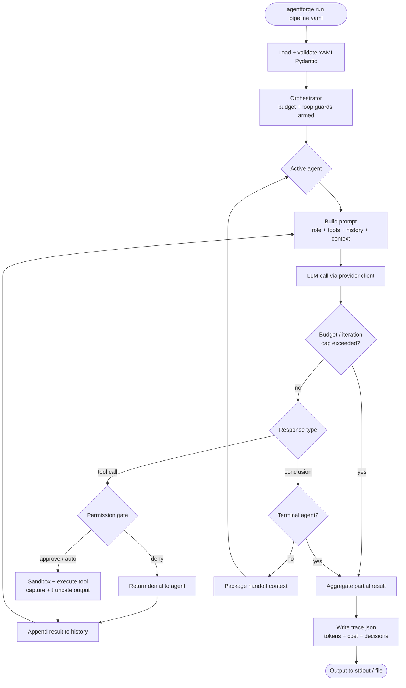
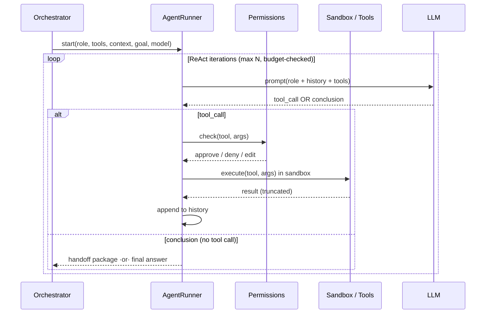
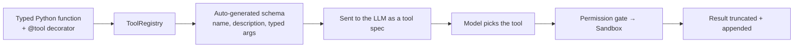
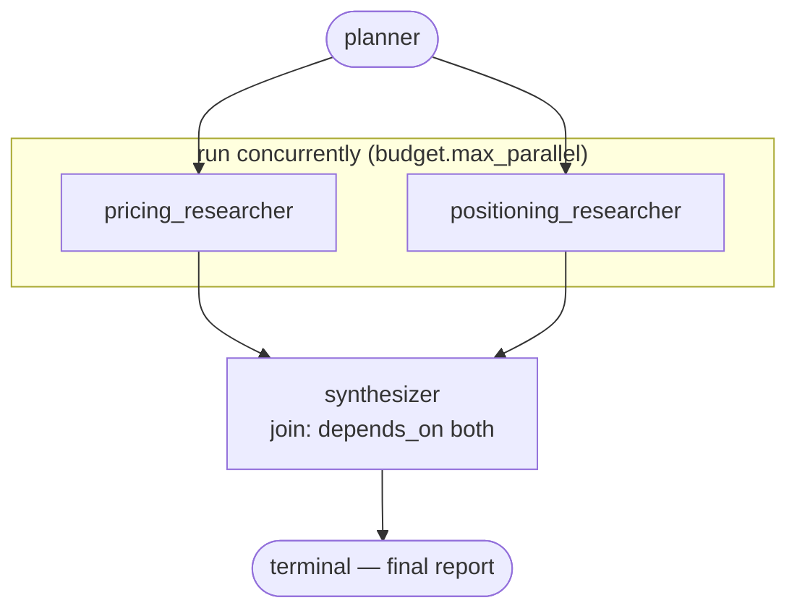

# 🛠️ AgentForge

[](https://github.com/HamzaElSousi/agentforge/actions/workflows/tests.yml)
[](https://www.python.org/downloads/)
[](LICENSE)

**Build multi-agent AI pipelines from a YAML file — bring your own model, your own provider, your own tools. No framework lock-in.**

AgentForge runs a pipeline of agents you define in a config file. Each agent has a role, a set of tools, an optional per-agent model, and a handoff rule. The runtime runs the **ReAct loop**, executes tools in a **sandbox**, pauses for **human approval** on side-effecting tools, enforces a **hard per-run dollar cap**, handles **handoffs**, and writes a full **`trace.json`**.

It works with any [OpenRouter](https://openrouter.ai) model and direct Anthropic / OpenAI / local Ollama — and it's small enough to read in an afternoon, so you actually understand what LangGraph/AutoGen do underneath.

| | LangGraph / CrewAI | **AgentForge** |
|---|---|---|
| Pipeline definition | Python code | **A YAML file** |
| Provider lock-in | Heavy | **None — BYO model** |
| First-class cost cap | ✗ | **✓ hard USD abort** |
| Sandbox + permissions | Add-on / none | **Built-in, tiered** |
| Lines to grok the core | thousands | **~1.5k** |

> **Status:** V1 shipped & live-verified; V2 DAG pipelines, parallel execution, and dynamic fan-out have all landed (with live parallel lanes in the dashboard).

---

## 🖥️ Live dashboard — no commands to remember

Pick a pipeline, type a goal, hit Run, and watch the agents, tool calls, permission decisions, and **cost** stream in real time:


```bash
pip install -e ".[web]"
agentforge serve            # → http://127.0.0.1:8000
```

The dashboard lists your `examples/*.yaml`, lets you edit the YAML inline, streams every step live, and offers the full `trace.json` as a download. (Recorded above: a real 3-agent run on `deepseek/deepseek-v4-flash` — note the live cost meter and the workspace-jail blocking an absolute-path write.)

---

## ⚡ Bring your own API key

> AgentForge ships with **no API key** and never calls anyone else's account. You supply your **own** `OPENROUTER_API_KEY` (or Anthropic/OpenAI), it lives in your gitignored `.env`, and you are billed by your provider — typically **~$0.01–0.03 per 3-agent run**. Prefer zero cost? Set `provider: ollama` and run fully offline against a local model.

---

## What it looks like

```yaml
# pipeline.yaml — a 3-agent research pipeline
name: competitor-research

llm:
  provider: openrouter                 # openrouter | anthropic | openai | ollama
  model: deepseek/deepseek-v4-flash    # strong, cheap, 1M context
  api_key_env: OPENROUTER_API_KEY

budget:
  max_usd_per_run: 0.25                # hard cap — aborts the run if exceeded
  max_total_iterations: 30

sandbox:
  backend: subprocess                  # subprocess | docker | e2b
  network: false
  timeout_s: 20

permissions:
  mode: prompt                         # auto | prompt | strict
  auto_approve: [web_search, read_url, read_note]   # read-only → run freely
  require_approval: [write_file]                     # side-effecting → ask first
  non_interactive: deny                # no TTY (CI): deny | allow_auto_approved

agents:
  researcher:
    role: Search the web and collect key facts. When you have 5+, hand off to the writer.
    tools: [web_search, read_url, save_note]
    handoff_to: writer
    max_iterations: 10
  writer:
    role: Read the notes and write a 300-word analysis, then hand off to the reviewer.
    model: qwen/qwen3.6-flash          # per-agent override — cheaper model for a simpler job
    tools: [read_note, write_file]
    handoff_to: reviewer
  reviewer:
    role: Review the draft for accuracy and clarity. Return the final version.
    tools: [read_file, write_file]
    terminal: true

start: researcher
```

```bash
agentforge run pipeline.yaml --goal "Research Notion's pricing and positioning vs Linear"
```

---

## Install (2 steps, ~3 minutes)

```bash
# 1) install (editable clone, or straight from git)
git clone https://github.com/HamzaElSousi/agentforge && cd agentforge
python3.11 -m venv .venv && source .venv/bin/activate
pip install -e .
#    …or:  pip install git+https://github.com/HamzaElSousi/agentforge.git

# 2) add your key
cp .env.example .env        # then put your OPENROUTER_API_KEY in it
```

```bash
agentforge models                                   # live tool-capable models + pricing
agentforge validate examples/research-pipeline.yaml # check a pipeline without running it
agentforge estimate examples/research-pipeline.yaml --goal "…"   # project cost, spend nothing
agentforge run examples/research-pipeline.yaml --goal "Summarise the latest on Claude 4"
```

---

## How it works

### Pipeline execution flow



### The ReAct loop (a single agent)



### Registering a tool



A custom tool is **under 10 lines** — decorate any typed function and it's available to any pipeline:

```python
from agentforge.tools.registry import tool, ToolContext

@tool(risk="read_only")
def word_count(ctx: ToolContext, text: str) -> int:
    """Count the words in a piece of text."""
    return len(text.split())
```

The argument schema (`text: string`, required) is generated from the signature; the description comes from the docstring; `ctx` is injected by the runtime and hidden from the model.

---

## 🔀 Parallel pipelines (DAG mode)

A pipeline doesn't have to be a straight chain. Instead of `handoff_to`, an agent can declare `depends_on: [other agents]` to wire a **DAG**. The runtime topologically sorts the agents, runs **independent branches concurrently** on a thread pool (`budget.max_parallel`, default 4), and a **join** agent (`depends_on: [a, b]`, usually `terminal: true`) waits for **all** its dependencies and receives every one of their outputs as context. Cycles are rejected at config load.

Every V1 guarantee still holds across threads — the hard budget cap, sandbox, permissions, loop guards, and trace are all thread-safe, and the first branch to hit a cap **cancels the rest gracefully** (you still get a partial result + trace). Because LLM calls are I/O-bound, threads give real concurrency with no asyncio rewrite. Set `max_parallel: 1` for a deterministic sequential run.



```yaml
# examples/research-dag.yaml (trimmed) — planner ─▶ two researchers ∥ ─▶ synthesizer
budget:
  max_usd_per_run: 0.30
  max_parallel: 4                # DAG branches run concurrently (1 = sequential)

agents:
  planner:
    role: Split the goal into a pricing angle and a positioning angle.
    tools: [save_note]

  pricing_researcher:
    role: Research the pricing & plan tiers for both products.
    tools: [web_search, read_url, save_note]
    depends_on: [planner]                       # DAG edge — waits for the planner

  positioning_researcher:
    role: Research positioning — who each product targets and why.
    tools: [web_search, read_url, save_note]
    depends_on: [planner]                       # independent of pricing_researcher → runs in parallel

  synthesizer:
    role: Merge both research streams into one comparison + recommendation.
    tools: [read_note, write_file]
    depends_on: [pricing_researcher, positioning_researcher]   # join — waits for both
    terminal: true

start: planner
```

```bash
agentforge run examples/research-dag.yaml --goal "Compare Notion and Linear" --yes
```

**Fan-out** goes further: an agent produces a list and the runtime spawns one worker **instance per item** (`fan_out: {to, max}`), runs them concurrently, and a join merges them. The dashboard renders the concurrent instances as side-by-side lanes under a fan-out group:


```bash
agentforge run examples/fanout-research.yaml --goal "Compare Notion, Linear, and Asana for product teams" --yes
```

---

## Safety is first-class, not an afterthought

| Layer | What it does |
|---|---|
| 💸 **Budget cap** | Live per-call token + USD accounting; a conservative pre-call check **aborts the run** before it crosses `max_usd_per_run`, returning a partial result + trace. `--estimate` projects cost without spending. |
| 🧰 **Tiered sandbox** | Tool/code execution runs in `subprocess` (rlimits, no network, workspace-jailed CWD, wall-clock timeout) — upgradeable to `docker` or cloud `e2b`. `run_python` is **opt-in**. |
| 🛡️ **Agent security** | **SSRF guard** (blocks loopback/private/link-local + `169.254.169.254`, re-checks every redirect), **workspace jail** (path-traversal blocked), **prompt-injection containment** (tool output is treated as data, never instructions). |
| 🙋 **Human-in-the-loop** | Tools are risk-classified; side-effecting calls pause for **approve / deny / edit-args / always-allow**. No TTY (CI)? The `non_interactive` policy **never hangs** — it denies or runs only auto-approved tools. Every decision is logged in the trace. |
| 🔁 **Loop safety** | Per-agent + pipeline iteration caps, handoff-cycle detection, repeated-action detection, wall-clock timeouts — all **graceful** (log + partial result, never a crash). |
| 🔑 **Secret hygiene** | API keys come from env, are never passed into agent context, and are **redacted** from `trace.json`. |

**Sandboxed `run_python` in action** — the code-review pipeline writes a buggy function, executes it in the subprocess sandbox to reproduce a `ZeroDivisionError`, then the fixer hands back a guarded version (every call permission-gated):


---

## Configuration reference

| Section | Key | Default | Meaning |
|---|---|---|---|
| `llm` | `provider` | `openrouter` | `openrouter` · `anthropic` · `openai` · `ollama` |
| | `model` | `deepseek/deepseek-v4-flash` | Default model slug (per-agent override allowed) |
| | `api_key_env` | `OPENROUTER_API_KEY` | Env var to read the key from |
| `budget` | `max_usd_per_run` | `0.25` | Hard cap; run aborts with a partial result if crossed |
| | `max_total_iterations` | `30` | Cap across all agents (kills ping-pong) |
| | `max_parallel` | `4` | DAG mode: max branches run concurrently (1 = sequential) |
| `sandbox` | `backend` | `subprocess` | `subprocess` · `docker` · `e2b` |
| | `network` | `false` | Allow network inside the sandbox (web tools are exempt) |
| | `timeout_s` / `cpu_seconds` / `memory_mb` | `20` / `10` / `512` | Resource limits |
| | `allow_run_python` | `false` | Opt-in flag to enable the `run_python` tool |
| `permissions` | `mode` | `prompt` | `auto` · `prompt` · `strict` |
| | `auto_approve` / `require_approval` / `deny` | `[]` | Per-tool overrides (`deny` always wins) |
| | `non_interactive` | `deny` | CI policy: `deny` · `allow_auto_approved` |
| `agents.<name>` | `role` | — | The agent's system prompt / job |
| | `tools` | `[]` | Allow-listed tool names for this agent |
| | `model` | inherits `llm.model` | Per-agent model override |
| | `handoff_to` / `terminal` | — | Sequential edge, or the final agent |
| | `depends_on` | `[]` | DAG dependencies (alternative to `handoff_to`); a join lists multiple |
| | `max_iterations` | `10` | Per-agent ReAct cap |

### Built-in tools

`web_search` · `read_url` (SSRF-guarded) · `read_file` · `write_file` · `save_note` · `read_note` (workspace-jailed) · `run_python` (opt-in, sandboxed). Plus any `@tool` you register.

---

## The trace

Every run writes `trace.json` — fully debuggable, including exactly where the money went:

```json
{
  "pipeline": "competitor-research",
  "goal": "Research Notion vs Linear",
  "duration_ms": 14320,
  "cost": { "total_usd": 0.0182, "prompt_tokens": 142880, "completion_tokens": 9120 },
  "stopped_reason": "completed",
  "agents": [
    {
      "name": "researcher",
      "model": "deepseek/deepseek-v4-flash",
      "iterations": 7,
      "cost_usd": 0.0121,
      "tool_calls": [
        { "tool": "web_search", "args": {"query": "Notion pricing 2026"},
          "result": "…(truncated)", "outcome": "approved", "auto": true }
      ],
      "handoff_context": "Found: Notion Free/Plus/Business tiers…"
    }
  ],
  "final_output": "Competitive analysis: …"
}
```

---

## Run it free / offline (Ollama)

```yaml
llm:
  provider: ollama
  model: llama3.1          # any local model you've pulled
  base_url: http://localhost:11434
```

No key, no cost. Models without native tool-calling automatically use the tolerant **text-ReAct** fallback (`Thought / Action / Action Input`).

> **Seen it run.** The 3-agent pipeline in [`examples/research-pipeline.ollama.yaml`](examples/research-pipeline.ollama.yaml) was run end-to-end against a local `gemma4:e4b` model — researcher → writer → reviewer — producing a real Notion-vs-Linear competitive analysis. The full execution trace is committed at [`examples/sample-trace.json`](examples/sample-trace.json): every tool call, argument, result, handoff, and token count.

---

## Development

```bash
pip install -e ".[dev]"
pytest tests/ -v          # ~250 tests, zero real API calls (scripted fake LLM client)
```

Tests use a scripted `FakeLLMClient`, so the whole suite is deterministic and offline. Optional extras: `pip install -e ".[web,anthropic,openai,docker,e2b]"`.

---

## Limitations

- **V2 DAG mode is live** — agents can `depends_on` each other and independent branches run in parallel (`budget.max_parallel`) with fan-in joins, plus dynamic **fan-out** (one agent → N concurrent workers) (see [Parallel pipelines](#-parallel-pipelines-dag-mode)).
- The `subprocess` sandbox blocks network via a socket guard and caps resources via `rlimit` (POSIX) — for hostile code use the `docker` or `e2b` backend for real isolation.
- Cost figures depend on provider-reported token counts; the pre-call cap is conservative but a single in-flight call can overshoot slightly unless `llm.max_tokens` bounds completion.

---

## License

MIT — see [LICENSE](LICENSE). Bring your own API key; you are responsible for your own provider usage and spend.
